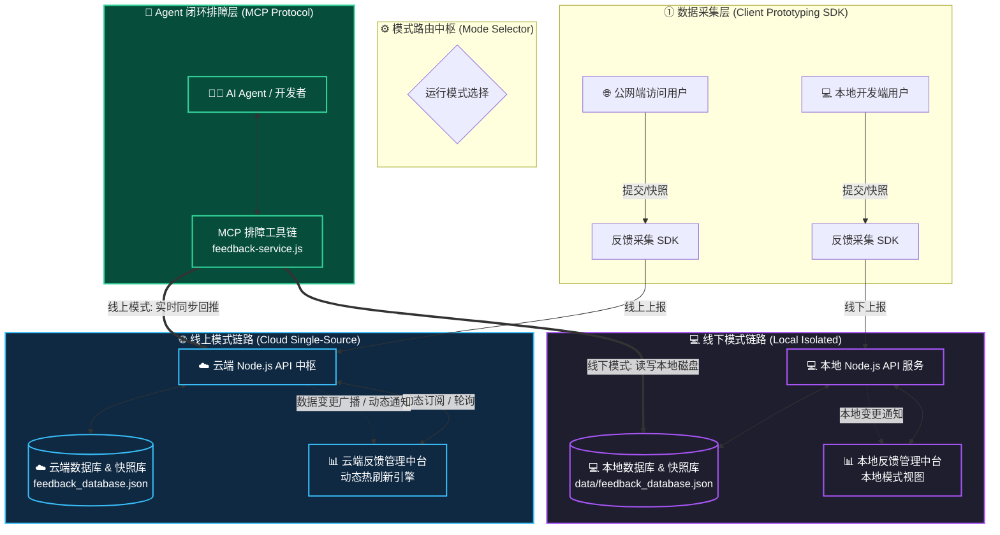
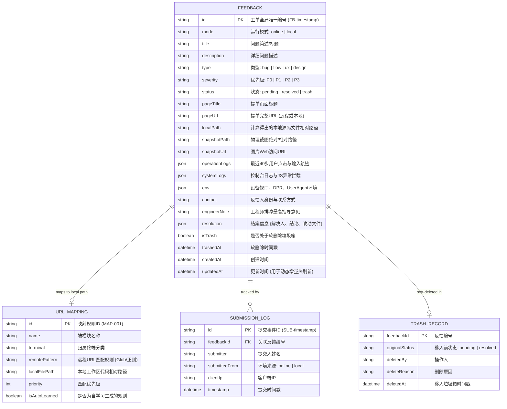
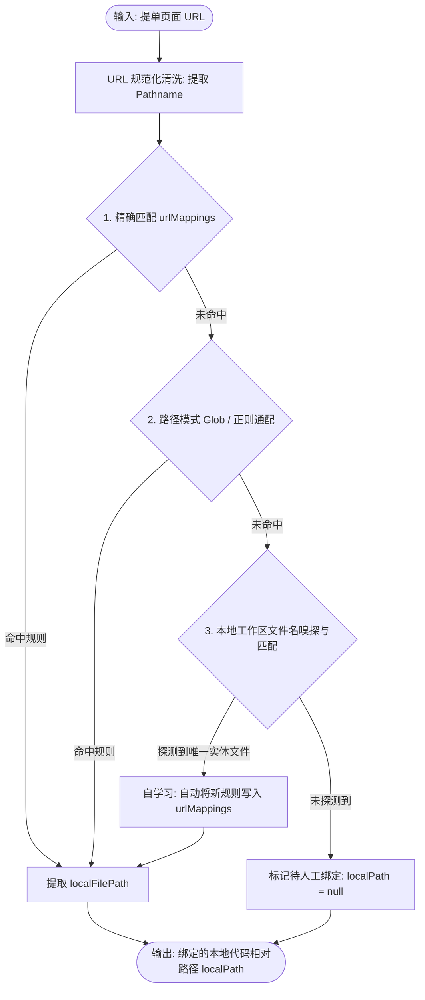
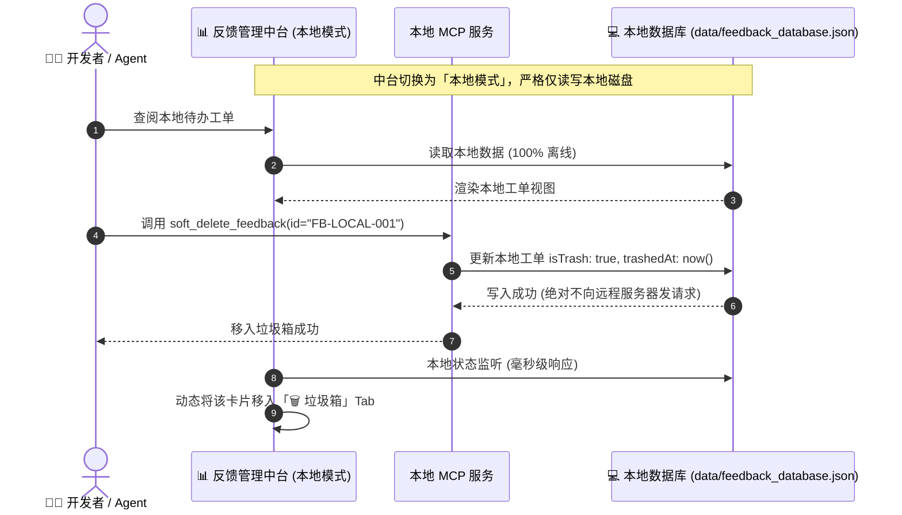

# 反馈与 Agent 闭环排障中枢重构与数据统一定位落地方案 (双模式实时协同版)

> **文档版本**: V3.2.0 (Dual-Mode Realtime Edition)  
> **编制日期**: 2026-09-05  
> **核心定位**: 严格划分**【线上模式】**与**【线下模式】**，实现统一数据底座、MCP 实时双向推送、反馈中台动态热刷新与智能 URL 源码定位的企业级排障技术实施蓝图。

---

## 目录

1. [项目背景与重构核心动因](#1-项目背景与重构动因)
2. [双模式 (线上 / 线下) 核心架构设计](#2-双模式-线上--线下-核心架构设计)
3. [统一数据模型与实体关系设计 (ER)](#3-统一数据模型与实体关系设计-er)
4. [智能页面位置映射引擎 (URL ↔ 本地代码)](#4-智能页面位置映射引擎-url--本地代码)
5. [双模式全链路时序图与动态热刷新机制](#5-双模式全链路时序图与动态热刷新机制)
6. [应用层：反馈管理中台 (Dashboard 3.0) 规格](#6-应用层反馈管理中台-dashboard-30-规格)
7. [MCP 服务端与 RESTful 接口契约](#7-mcp-服务端与-restful-接口契约)
8. [存量数据平滑迁移与安全备份](#8-存量数据平滑迁移与安全备份)
9. [实施计划、交付物与质量验收门禁](#9-实施计划交付物与质量验收门禁)

---

## 1. 项目背景与重构核心动因

在 5 端全景原型（求职端、C端经纪人、B端小程序、B端Web后台、平台运营端）与 AI Agent 排障协同的深度实践中，旧版反馈机制暴露出以下核心痛点：

1. **环境与数据源边界模糊**：
   此前本地与线上数据自动混合拉取，导致线上真实工单与本地调试数据交织，难以清晰界定生产与测试边界；
2. **MCP 修改后中台感知延迟**：
   AI Agent 在终端调用 MCP 修改工单状态（如添加工程师排障意见、标记已解决、移入垃圾箱）后，云端服务器或本地服务已更新，但用户打开的反馈中台页面缺乏动态感知机制，需要手动 F5 刷新；
3. **远程 URL 缺少本地代码自动映射**：
   公网提单为网络 URL，Agent 接单后无法秒级定位到本地对应的 HTML/JS 源码文件；
4. **清理缺乏软删除保护**：
   物理删除在多端同步时易引发缓存复活。

为此，依据最新的**《反馈机制架构图（重构版）：数据统一化设计》**，正式确立**【线上模式】**与**【线下模式】**两大独立运行轨，并在 MCP 变更时支持实时同步与中台动态热刷新。

---

## 2. 双模式 (线上 / 线下) 核心架构设计

系统严格解耦为**两大工作模式**，通过统一数据协议实现隔离与互通：

```
┌────────────────────────────────────────────────────────────────────────────────────────────────────────┐
│ 🌐 线上模式 (Online Mode) —— 数据统一源: 云端服务器 (Cloud Server)                                       │
│    • 数据存储：存储在云端服务器 /www/wwwroot/zhengjie-hrm/data/feedback_database.json 与 snapshots 目录 │
│    • 反馈中台：不论部署在公网还是本地启动，均直连读取云端服务器数据                                    │
│    • MCP 排障：Agent 在本地通过 MCP 修改工单后，毫秒级实时回推同步至云端服务器                           │
│    • 动态热刷新：云端数据发生变更（提单/MCP结案/指导意见录入），中台实时感知并自动增量刷新 UI          │
├────────────────────────────────────────────────────────────────────────────────────────────────────────┤
│ 💻 线下模式 (Offline / Local Mode) —— 数据统一源: 本地磁盘 (Local Workspace)                             │
│    • 数据存储：存储在本地工作区 data/feedback_database.json 与本地 data/snapshots/ 目录                 │
│    • 反馈中台：严格只读取本地数据库，100% 离线运行，绝对不污染远程云端                                 │
│    • MCP 排障：直接读写本地磁盘文件，毫秒级就绪                                                          │
│    • 动态热刷新：本地文件变更通过本地事件/轮询毫秒级响应，中台动态更新                                 │
└────────────────────────────────────────────────────────────────────────────────────────────────────────┘
```

### 2.1 总体双模式系统架构拓扑图 (Mermaid)



---

## 3. 统一数据模型与实体关系设计 (ER)

无论在线上服务器还是本地磁盘，统一数据底座均遵循严格的 **4 表关系模型**，杜绝异构字段。

### 3.1 实体关系模型 (Mermaid ER Diagram)



---

## 4. 智能页面位置映射引擎 (URL ↔ 本地代码)

位置映射引擎负责在**线上模式**下将远程公网 URL 瞬间翻译为本地开发工作区的源码文件路径。

### 4.1 映射解析算法流程图 (Mermaid)



### 4.2 预置默认映射表 (Default Seed Mappings)

| 规则编号 | 终端模块 | 远程 URL 匹配模式 (`remotePattern`) | 本地工作区文件路径 (`localFilePath`) |
| :--- | :--- | :--- | :--- |
| `MAP-001` | **求职者小程序端** | `**/q-wechat-app.html*` | `求职者小程序端/q-wechat-app.html` |
| `MAP-002` | **C端人才经纪人端** | `**/c-wechat-app.html*` | `C端人才经纪人小程序端/c-wechat-app.html` |
| `MAP-003` | **B端企业小程序端** | `**/b-wechat-app.html*` | `B端企业小程序端/b-wechat-app.html` |
| `MAP-004` | **B端企业Web后台** | `**/b-web-admin.html*` | `zhengjiehrm-发布版-20260828/B端企业端-Web管理后台/b-web-admin.html` |
| `MAP-005` | **平台运营端** | `**/op-web-app.html*` | `平台运营端/op-web-app.html` |
| `MAP-006` | **五端演示大厅** | `**/index.html*` | `index.html` |
| `MAP-007` | **内部验收大厅** | `**/checking*` | `checking/index.html` |

---

## 5. 双模式全链路时序图与动态热刷新机制

### 5.1 线上模式：MCP 修改 ➔ 实时回推服务器 ➔ 中台动态热刷新时序图 (Mermaid)

```mermaid
sequenceDiagram
    autonumber
    actor Agent as 🤖 AI 编码 Agent (本地)
    participant MCP as Feedback MCP Server (本地)
    participant CloudServer as ☁️ 云端 Node.js API 服务
    participant CloudDB as ☁️ 云端数据库 (feedback_database.json)
    participant Dashboard as 📊 反馈管理中台 (线上模式)

    Note over Dashboard,CloudServer: 1. 中台处于「线上模式」，建立数据版本心跳监听
    Dashboard->>CloudServer: GET /api/feedback/summary?mode=online
    CloudServer-->>Dashboard: 返回当前版本戳 (dataVersion: 1788190000)

    Note over Agent,MCP: 2. Agent 接收工单并执行修复
    Agent->>MCP: 调用 resolve_feedback(id="FB-001", notes="修复完成", files=["q-wechat-app.html"])
    
    rect rgb(6, 78, 59)
    Note over MCP,CloudServer: 3. MCP 实时同步回推至服务器
    MCP->>CloudServer: POST /api/feedback/resolve (带云端凭证与修改详情)
    CloudServer->>CloudDB: 更新工单为 resolved，版本戳自增 (dataVersion++)
    CloudDB-->>CloudServer: 持久化成功
    CloudServer-->>MCP: 200 OK (实时同步完成)
    MCP-->>Agent: 结案成功回报
    end

    rect rgb(15, 41, 66)
    Note over Dashboard,CloudServer: 4. 反馈中台动态热刷新
    Dashboard->>CloudServer: 动态心跳探测 (发现 dataVersion 发生变化)
    CloudServer-->>Dashboard: 返回最新已结案数据与最新版本戳
    Dashboard->>Dashboard: 无感热重载 UI，对应卡片毫秒级变绿 (已解决)
    end
```



### 5.2 线下模式：本地独立闭环排障时序图 (Mermaid)



---

## 6. 应用层：反馈管理中台 (Dashboard 3.0) 规格

`feedback-dashboard.html` 全面重构为**双模式动态响应中台**：

### 6.1 核心交互组件规格
1. **模式切换顶栏 (Mode Switcher)**:
   - `[ 🌐 线上模式 ]` / `[ 💻 线下模式 ]` 胶囊切换按钮；
   - 附带实时连接状态呼吸灯（`🟢 线上服务器已连接: http://...` / `🟣 本地数据库: 离线就绪`）。
2. **三栏 Tab 治理架构**:
   - **Tab 1: 📋 活跃工单 (待处理 / 已完成)** —— 动态卡片流，带「远程 ➔ 本地源码路径」智能胶囊；
   - **Tab 2: 🗺️ 位置映射中心** —— 可视化配置并测试远程 URL 与本地源文件的对应规则；
   - **Tab 3: 🗑️ 软删除垃圾箱** —— 隔离废弃/测试数据，支持「一键恢复」与「彻底粉碎」，彻底阻断反向同步复活。
3. **动态热刷新引擎 (Auto-Refresh & Polling)**:
   - 引入轻量级数据版本戳机制（`dataVersion`）；
   - 开启动态热刷新后，每 2~3 秒轻量探测版本戳，数据有变立即平滑重绘，无需手动刷新页面。
4. **升级版 AI 修复 Prompt 引擎**:
   - 一键复制的指令自动提取并注入 `localFilePath`、`physicalSnapshotPath`、`engineerNote`，Agent 复制即修。

---

## 7. MCP 服务端与 RESTful 接口契约

### 7.1 9 大标准 MCP 工具清单 (`mcp/feedback-service.js`)

| 工具名称 | 功能说明 | 线上模式行为 | 线下模式行为 |
| :--- | :--- | :--- | :--- |
| `list_feedback` | 获取工单列表 (支持状态/优先级过滤) | 从云端服务器拉取实时工单 | 从本地磁盘数据库读取 |
| `get_feedback` | 获取详情 (含 `localPath` 与图片) | 自动从云端下载缺失快照并返回物理路径 | 直接返回本地物理快照路径 |
| `resolve_feedback` | 结案工单并记录改动文件 | **毫秒级实时回推推送到云端服务器** | 更新本地数据库为 `resolved` |
| `add_engineer_note` | 录入工程师最高指导意见 | **实时推送同步到云端服务器** | 写入本地数据库并落盘 |
| `soft_delete_feedback` | 移入垃圾箱 (软删除) | **实时推送到云端并标记 `isTrash`** | 更新本地数据，隔离至垃圾箱 |
| `restore_feedback` | 从垃圾箱撤销恢复 | **实时推送云端恢复为活跃工单** | 本地撤销恢复为 `pending` |
| `purge_feedback` | 物理彻底销毁 | 物理清理云端工单与图片 | 物理删除本地记录与图片 |
| `get_url_mappings` | 查询当前映射规则列表 | 读取映射配置 | 读取本地映射配置 |
| `add_url_mapping` | 动态新增/更新 URL 映射 | 写入映射表 | 写入本地映射表 |

### 7.2 RESTful API 路由清单 (Node.js Server)

| 方法 | 路径 | 功能说明 | 核心参数 |
| :--- | :--- | :--- | :--- |
| `GET` | `/api/feedback/list` | 查询工单列表 | `?mode=online|local&status=&includeTrash=` |
| `POST` | `/api/feedback/save` | 新增/批量同步工单 | `{ mode, pageUrl, title, description, snapshot, ... }` |
| `GET` | `/api/feedback/summary` | 获取统计摘要与版本戳 | `?mode=online|local` ➔ `{ total, pending, dataVersion, ... }` |
| `POST` | `/api/feedback/resolve` | 结案已修复工单 | `{ id, resolvedBy, notes, filesModified }` |
| `POST` | `/api/feedback/engineer-note`| 录入工程师指导意见 | `{ feedback_id, engineer_note, engineer_author }` |
| `POST` | `/api/feedback/trash` | 移入垃圾箱 (软删除) | `{ id, reason }` |
| `POST` | `/api/feedback/restore` | 垃圾箱撤销恢复 | `{ id }` |
| `POST` | `/api/feedback/purge` | 彻底物理销毁 | `{ id, deleteSnapshotFile }` |
| `GET` | `/api/mappings/list` | 查询 URL 映射表 | 无 |
| `POST` | `/api/mappings/save` | 保存/修改映射规则 | `{ id, remotePattern, localFilePath, terminal }` |
| `GET` | `/data/snapshots/:file` | 物理快照图片托管 | 静态 PNG 图片响应 |

---

## 8. 存量数据平滑迁移与安全备份

1. **备份完备性**: 本地存量 46 条工单与 77 张快照已安全封存在 `backups/feedback_hub_backup_20260905_200455.tar.gz` (12.72 MB，100% SHA256 校验通过)；
2. **平滑升级迁移**:
   - 编写 `scripts/migrate_v31_dual_mode.js`；
   - 自动为所有存量工单注入 `mode`、`localPath`、`isTrash` 字段；
   - 将历史测试脏数据平滑注入 `trashBin` 软删除隔离区，保证活跃工单清爽可靠。

---

## 9. 实施计划、交付物与质量验收门禁

### 9.1 四阶段实施计划

```
┌─────────────────────────────────────────────────────────────────────────────┐
│ 📅 阶段一：双模式数据模型与迁移脚本实施 (Data & Migration)                  │
│    • 构建 4 表统一结构，注入 dataVersion 机制                                │
│    • 执行存量数据无损升轨，初始化 urlMappings 预置规则                       │
├─────────────────────────────────────────────────────────────────────────────┤
│ 📅 阶段二：位置映射引擎、MCP 实时推送与服务端 API 升级 (Engine & MCP)        │
│    • 在 scripts/server.js 落地双模式路由、软删除、恢复与数据版本戳接口      │
│    • 升级 mcp/feedback-service.js，实现 MCP 修改后毫秒级实时回推服务器      │
├─────────────────────────────────────────────────────────────────────────────┤
│ 📅 阶段三：应用层 Dashboard 3.0 双模式与动态热刷新重构 (Dashboard UI)       │
│    • 落地 [线上模式] / [线下模式] 切换开关与三栏 Tab 视图                    │
│    • 接入动态热刷新引擎（根据 dataVersion 自动无感重绘）                    │
│    • 升级 AI 修复 Prompt 生成引擎（直达 mapped 本地代码相对路径）            │
├─────────────────────────────────────────────────────────────────────────────┤
│ 📅 阶段四：自动化回归自验与云端/开源同步 (E2E Testing & Deploy)             │
│    • 编写 Playwright 自动化测试脚本，验证 MCP 实时推送与中台热刷新闭环       │
│    • 部署更新至腾讯云公网服务器，并同步更新 GitHub 仓库                      │
└─────────────────────────────────────────────────────────────────────────────┘
```

### 9.2 质量验收门禁 (Definition of Done)
- [ ] **模式隔离与纯净**: 线下模式下所有操作绝对不向云端发送任何请求；线上模式下数据统一读取与同步至云端；
- [ ] **MCP 实时同步**: Agent 在本地调用 MCP 工具（结案/写指导意见/删工单）后，云端服务器在 1 秒内完成入库更新；
- [ ] **中台动态热刷新**: 中台处于开启状态时，无需手动 F5，数据变更后 2 秒内自动平滑更新卡片状态；
- [ ] **智能位置映射**: 5 大端常规页面提单，本地源码文件路径命中率 100%；
- [ ] **自动化测试通过率**: Playwright 双模式全流程 E2E 测试 100% PASS，0 运行时报错。
