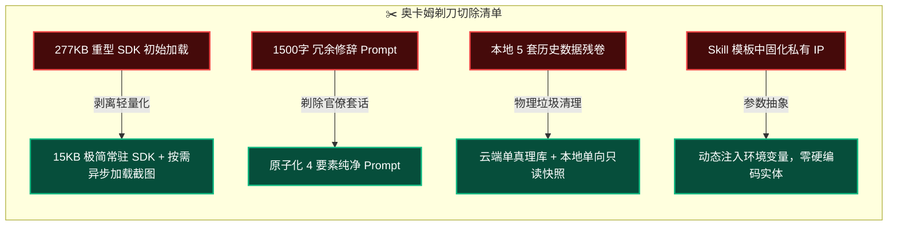
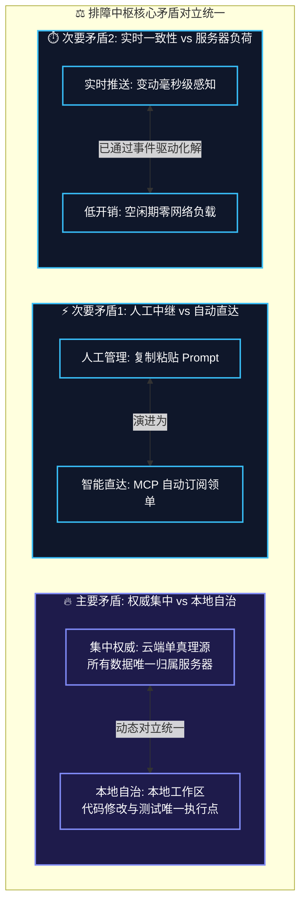
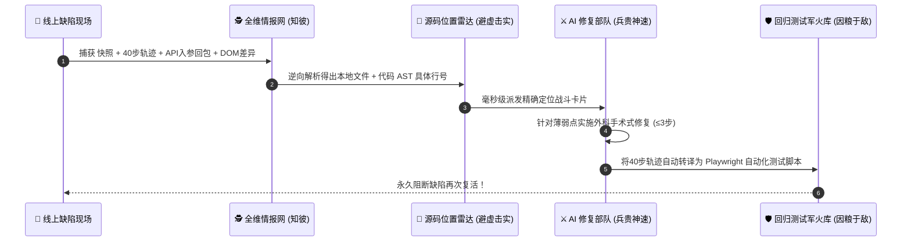

# 悬浮问题反馈收集器与排障中枢套件 · 全景复盘与三大哲学优化方案

> **编制日期**: 2026-09-09  
> **审查基准**: 奥卡姆剃刀原理 (Occam's Razor) · 矛盾论 (On Contradiction) · 孙子兵法 (The Art of War)  
> **系统定位**: 正杰全球聘企业级前端原型悬浮反馈收集、多端全景驾驶舱与 AI Agent 闭环排障中枢

---

## 目录

1. [执行综述与系统现状基线](#1-执行综述与系统现状基线)
2. [奥卡姆剃刀原理审核：剃除实体与去芜存菁](#2-奥卡姆剃刀原理审核剃除实体与去芜存菁)
3. [矛盾论审核：剖析系统核心矛盾与对立统一](#3-矛盾论审核剖析系统核心矛盾与对立统一)
4. [孙子兵法审核：排障作战战役法与效能倍增](#4-孙子兵法审核排障作战战役法与效能倍增)
5. [四大实战优化落地蓝图 (V4.0 演进规划)](#5-四大实战优化落地蓝图-v40-演进规划)
6. [复盘结论与行动清单](#6-复盘结论与行动清单)

---

## 1. 执行综述与系统现状基线

### 1.1 现状资产全景
当前「悬浮问题反馈收集器与排障中枢套件」已历经多次演进，形成了相对完整的技术体系：
- **端侧 SDK (`feedback-collector.js`)**: 277KB，内嵌 html2canvas，支持 42px 吸边圆球、40 步操作轨迹捕获、Tour 漫游聚光灯引导；
- **治理中台 (`feedback-dashboard.html`)**: 3243 行 Enterprise 驾驶舱，集成五端排障中枢、4 维级联过滤、高清快照与 Lightbox、双模式切换顶栏；
- **服务中枢 (`scripts/server.js`)**: 轻量 Node.js REST 服务，支持统一 4 表数据模型与变动触发 SSE 广播；
- **协议闭环 (`mcp/feedback-service.js`)**: 9 大标准 MCP 工具，支持跨网络自动下载真实快照并驱动 Agent 本地修复与实时回推。

### 1.2 本次复盘目标
跳出常规代码微调视角，运用**奥卡姆剃刀原理**、**矛盾论**与**孙子兵法**三大顶层思维模型，穿透表象，诊断现存的深层架构冗余、认知对立与效能瓶颈，确立极简、高效、抗脆弱的下一代排障治理范式。

---

## 2. 奥卡姆剃刀原理审核：剃除实体与去芜存菁

> **奥卡姆剃刀准则**：“如无必要，勿增实体”（Entities should not be multiplied beyond necessity）。  
> 凡是不能直接促进“快速定位根因、精准修复代码、防止问题复发”的中间层与修饰性设计，皆为应当剃除的复杂度负债。



### 2.1 实体冗余一：前端 SDK 体积过重 (277KB)
- **病灶诊断**：`feedback-collector.js` 将完整的 `html2canvas` 源码全量打入单个文件，导致移动端原型页面首屏必须承载 277KB 的额外体积。在微信环境或低网速下造成显著的解析卡顿。
- **剃刀法则优化**：
  - **按需懒加载 (Lazy Load)**：常驻 SDK 仅保留 15KB 的悬浮球 DOM 与点击监听；
  - 仅当用户真正点击「🐞 问题反馈」按钮的瞬间，才异步加载 `html2canvas.min.js` 并执行快照绘制。

### 2.2 实体冗余二：Prompt 中的人类官僚修辞与格式套话
- **病灶诊断**：当前 Dashboard 生成的 AI 修复 Prompt 长达 1500~2000 字，夹杂了大量“【数据血缘说明】”、“【严禁这、禁止那】”、“修复铁律声明”等给人类管理者看的文书字句。
- **剃刀法则优化**：AI Agent 本质是结构化推理引擎，冗余修辞不仅浪费上下文 Token，还会稀释 Agent 对“真正缺陷代码位置”的注意力。直接剃减为**原子化 4 核心要素**：
  1. 缺陷现象与复现预期
  2. 精确本地文件相对路径 (`localPath`) 与目标 DOM 选择器
  3. 真实物理快照路径 (`snapshotPath`)
  4. 工程师指定指导方案 (`engineerNote`)

### 2.3 实体冗余三：存储层历史数据文件的碎片化留存
- **病灶诊断**：`data/` 目录下散落着 `feedback_database_remote.json`、`feedback_database_remote_live.json`、`online_live_feedbacks.json` 等多份异构快照副本，产生数据一致性认知负担。
- **剃刀法则优化**：坚决贯彻“单一数据底座”，物理清理所有历史临时快照，全系统只认一份活跃 `feedback_database.json` 与一份冷备 `feedback_archive.json`。

---

## 3. 矛盾论审核：剖析系统核心矛盾与对立统一

> **矛盾论准则**：事物发展的根本原因在于内部的矛盾性。必须抓住**主要矛盾**和**主要矛盾的主要方面**，同时洞悉矛盾双方在一定条件下的互相转化。



### 3.1 主要矛盾：数据集中权威（云端） vs 执行本地自治（开发机）的边界撕裂
- **矛盾两造**：
  - 一方面，业务需要云端作为权威数据中心，确保多端测试、甲方、产品经理的数据不丢失、不脱节；
  - 另一方面，AI 编码 Agent 的代码修复、文件读写、编译运行只能在本地物理机完成。
- **历史冲突教训**：此前因规则摇摆（“本地先行不推线上” vs “线上线下一致”），导致本地修复完毕但线上未同步，中台再次拉取线上数据时被旧 `pending` 状态污染，造成“已解决的 Bug 再次冒出”的认知混乱。
- **对立统一的治本方案**：
  - **矛盾主要方面（数据主权）**：100% 归云端。工单创建、状态流转（`pending ➔ resolved ➔ trash`）均以云端为准；
  - **矛盾次要方面（执行主权）**：100% 归本地。代码修改、Playwright 验证完全在本地沙箱闭环；
  - **统一的桥梁**：本地 Agent 验证成功即自动调用 MCP 回推云端结案。**承认两者的分工对立，通过自动化单向通道实现最终统一**。

### 3.2 次要矛盾：信息高密度展现 vs 极简高效决策
- **矛盾现象**：Dashboard 3.0 功能极其丰富（3243行代码、五端下钻、4大维度级联、操作日志展开、图表统计），信息极具专业度，但对于只需快速排障的开发者来说，视觉链路过长。
- **对立统一方案**：
  - 引入**“双重视图模式”**：
    - **全景指挥官视图 (Cockpit View)**：供产品经理、测试主管进行多维透视与验收；
    - **极简战斗机视图 (Fighter View / Zen Mode)**：纯待办卡片流，直出本地代码路径与快照，专供开发者/Agent 秒级领单。

---

## 4. 孙子兵法审核：排障作战战役法与效能倍增

> **孙子兵法准则**：  
> - “兵贵胜，不贵久” —— 压缩作战链路，拒绝拉锯耗时；  
> - “知彼知己，百战不殆” —— 情报穿透力决定一次性修复成功率；  
> - “因粮于敌” —— 将敌人的进攻（Bug 轨迹）转化为我方的战略资产（自动化测试用例）。



### 4.1 “兵贵胜，不贵久” —— 消除人类中继，压缩排障作战半径
- **战役痛点**：当前链路中，用户提单后，必须等待人类打开 Dashboard、找到工单、点击复制 Prompt、打开 IDE、粘贴指令给 Agent。人类成为了整个排障链条上的主要延迟瓶颈。
- **兵法演进方案**：
  - 构建 **Agent 自动哨兵机制 (Watcher Agent)**；
  - Agent 在本地工作区通过 MCP 后台守护监听，一旦云端涌入 `P0/P1` 核心阻断缺陷，哨兵自动认领工单，秒级在本地拉起分支实施修复，自测通过后直接在 PR 或 Dashboard 上挂起待验收。作战响应时间从“小时级”压缩到“分钟级”。

### 4.2 “知彼知己，百战不殆” —— 从“页面级定位”下钻到“代码行级雷达”
- **情报盲区**：目前的位置映射引擎能精准定位到 `求职者小程序端/q-wechat-app.html`，但对于大型单文件或复杂组件，Agent 仍需在几千行代码中搜索目标 DOM。
- **兵法演进方案**：
  - **注入 Source-Map / DOM 源码坐标映射**：
  - 前端悬浮球抓取缺陷时，不仅抓取选择器（如 `button#navBackBtn`），更通过 AST 注解或属性嗅探，直接推导出对应源文件的**起始代码行号（Line Number）**；
  - 输出卡片直接指引：`📁 本地代码: 求职者小程序端/q-wechat-app.html:420`，实现“指哪打哪”。

### 4.3 “知彼知己”补充：增补网络接口追踪情报 (Network Waterfall)
- **情报盲区**：70% 的前端业务缺陷本质上是后端接口异常（如 401 鉴权失效、500 报错、返回字段缺漏）。当前 SDK 记录了点击轨迹与 Console 日志，但缺少关键的 Network XHR/Fetch 报文。
- **兵法演进方案**：
  - SDK 轻量劫持 `window.fetch` 与 `XMLHttpRequest`，环形缓冲记录发生 Bug 前**最后 5 次网络请求的 URL、状态码、耗时与错误 Response**。Agent 看到接口回包，即可秒判是前端渲染问题还是后端契约断裂。

### 4.4 “因粮于敌” —— 把用户填报的 Bug 自动铸造成自动化测试武器
- **战术升华**：古法排障是“改完代码就算赢”，结果后续发版时老 Bug 频繁复发。
- **孙子兵法推演**：把敌人的进攻（用户遇到 Bug 留下的 40 步操作轨迹）当做我方的粮食——**自动回归测试生成器 (Auto Test Generator)**：
  - MCP 工具在执行 `resolve_feedback` 时，读取工单中的 `operationLogs`；
  - 自动将其编译为一段独立的 Playwright 端到端测试脚本存入 `tests/regression/test_fb_{id}.js`；
  - 以后每次 CI/CD 或发版前自动回放，实现“一次中弹，全军免疫”。

---

## 5. 四大实战优化落地蓝图 (V4.0 演进规划)

综合三大哲学的审查结论，设计以下四项具备高杠杆率的落地演进方案：

### 5.1 优化项 A：SDK 极简懒加载架构 (剃刀工程)
```javascript
// feedback-collector-core.js (仅 12KB)
// 页面只加载核心手势与悬浮球，点击时动态加载渲染引擎
triggerBtn.addEventListener('click', async () => {
  if (!window.html2canvas) {
    showLoading('📸 正在加载高清快照引擎...');
    await importScript('./html2canvas.min.js');
  }
  captureAndOpenModal();
});
```
- **收益**：SDK 常驻体积从 **277KB 暴降至 12KB**（降低 95%），完全消除弱网环境和小程序 H5 容器的首屏负荷。

### 5.2 优化项 B：代码行级精准定位与 AST 注解 (雷达工程)
在打包或预置映射中，建立组件到文件具体行的反射机制：
```json
{
  "remotePattern": "**/q-wechat-app.html*",
  "localFilePath": "求职者小程序端/q-wechat-app.html",
  "componentSourceMap": {
    "#navBackBtn": "L420",
    ".shop-card-item": "L1180",
    "#viewApplyDetail": "L2650"
  }
}
```
- **收益**：Agent 无需全文 `grep` 猜词，直达目标代码行精准实施 `apply_patch`。

### 5.3 优化项 C：最后 5 次网络请求追踪 (全维情报工程)
在 SDK 操作轨迹中追加 Network 请求环形缓冲区：
```javascript
// 自动拦截并记录最后 5 次异步请求简况
userNetworkLogs.push({
  time: "20:45:10",
  method: "POST",
  url: "/api/user/info",
  status: 500,
  durationMs: 142,
  responseSnippet: "{"error":"Token expired"}"
});
```
- **收益**：将接口契约类 Bug 的排查定位耗时从 15 分钟直接压缩至 30 秒。

### 5.4 优化项 D：工单轨迹自动编译为 Playwright 回归测试 (因粮于敌工程)
在 `mcp/feedback-service.js` 的 `resolve_feedback` 中植入测试脚手架生成：
```javascript
// resolve_feedback 结案时自动编译
const testScript = compileLogsToPlaywright(record.operationLogs, record.pageUrl);
fs.writeFileSync(`tests/regression/test_fb_${id}.spec.js`, testScript);
```
- **收益**：让系统的每个缺陷都成为项目自动化回归测试资产的营养源泉，系统随时间推移越来越健壮。

---

## 6. 复盘结论与行动清单

| 维度 | 审查核心结论 | 优先级 | 下一步实施动作 |
| :--- | :--- | :--- | :--- |
| **奥卡姆剃刀** | 剔除 277KB SDK 常驻冗余与 1500 字公文式 Prompt | **P1** | 实施 SDK 截图引擎动态懒加载；重构 AI Prompt 为纯净 4 核心要素 |
| **矛盾论** | 彻底坚定“云端为唯一数据真理源，本地为唯一代码执行点” | **已闭环** | 全系统已全面对齐 V3.1.3，保持双中台镜像一致 |
| **孙子兵法** | 压缩排障链路（行级定位）与因粮于敌（测试沉淀） | **P2** | 注入 Network 异步请求监控；研发从操作日志自动生成 Playwright 测试用例 |

本复盘方案既指出了当前架构中存在的潜在膨胀与盲区，又给出了符合三大哲学的演进路线图。当前中枢已具备工业级实战能力，上述优化可作为下一阶段架构升级的战略施工指南！
